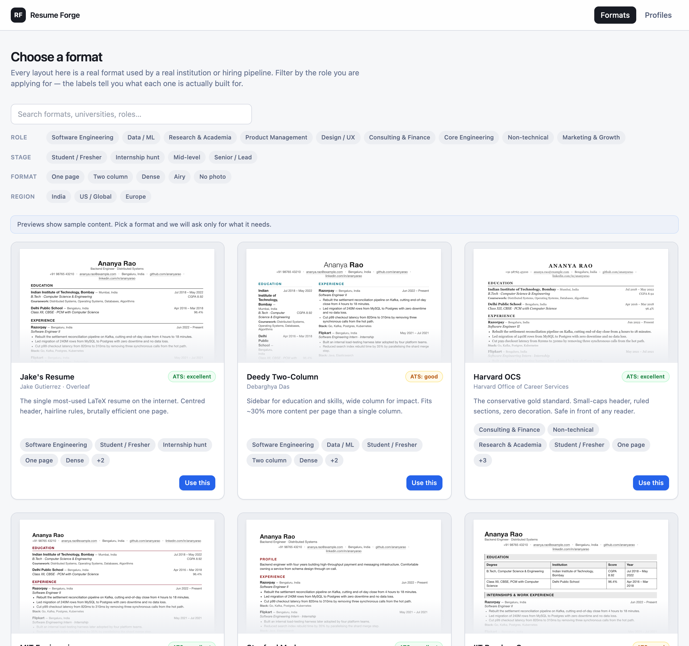
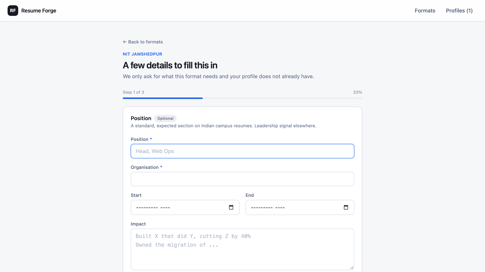
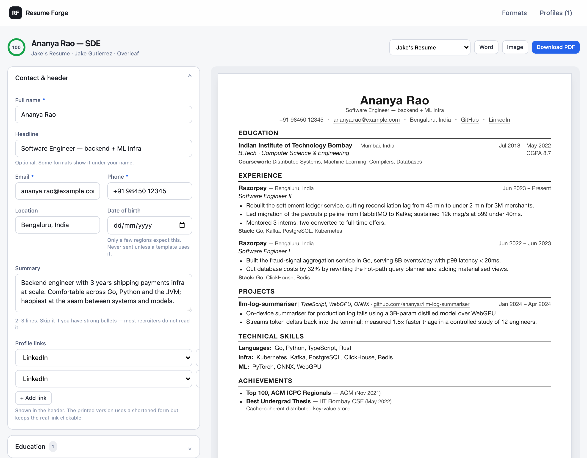
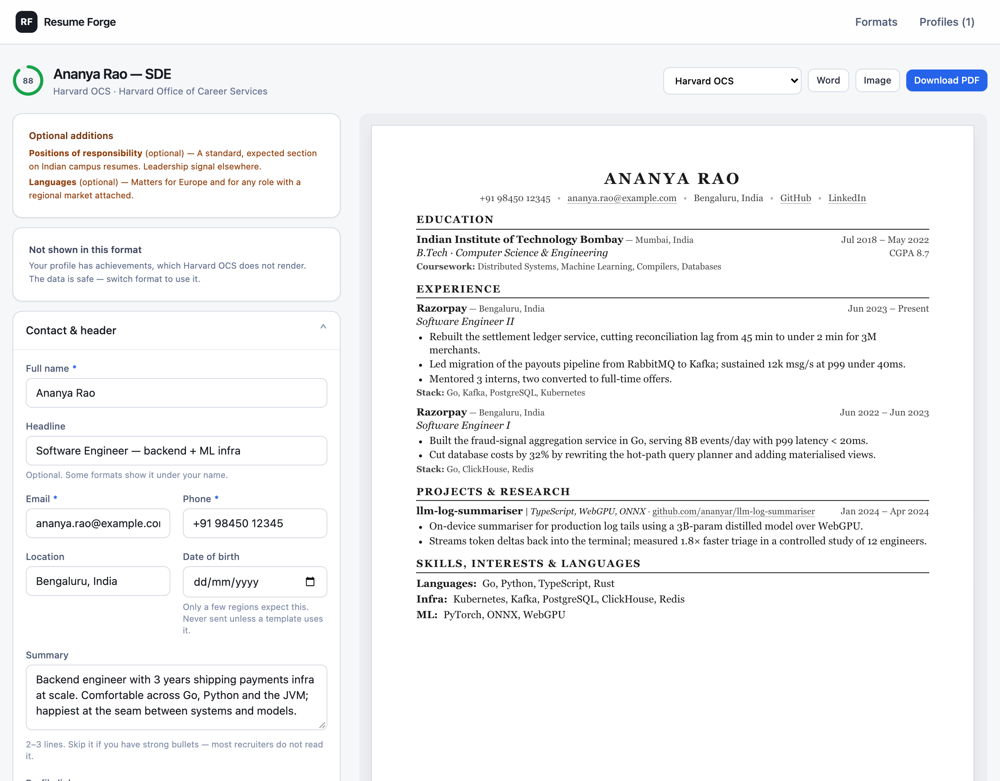
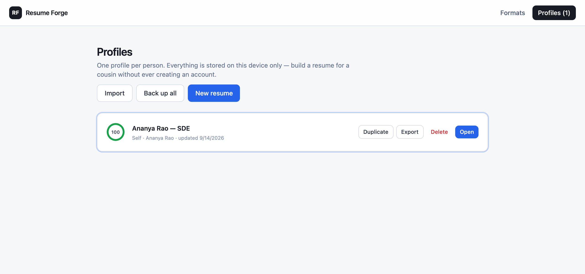

# resume-forge

[](https://github.com/RichardLitt/standard-readme)
[](https://github.com/SAQLAINAP/resume-forge/actions/workflows/android.yml)
[](https://github.com/SAQLAINAP/resume-forge/releases/latest)
[](./LICENSE)

> Offline-first, ATS-safe résumé builder. 32 résumé formats + 3 cover-letter layouts + 3 academic-CV templates (beta). Import a JSON Resume in a click, share a whole profile as a compressed URL that decodes without a server, keep alternate summaries per application, and export as PDF, Word, PNG or LaTeX / Markdown / HTML. No backend, no account, no network call anywhere.

Most web-based résumé builders emit PDFs that are secretly images and Word files that are secretly HTML tables — both of which shred when an applicant tracking system tries to parse them. Resume Forge treats parseability as the primary constraint: PDFs go through the browser's print pipeline so glyphs stay real, and Word files are constructed from the data model with native headings and bullets rather than converted from the DOM.

Because the whole app is a single web bundle with no external calls, it runs offline as a PWA, installs on Android via [Capacitor](https://capacitorjs.com/), and stores multiple profiles (yours, your family's, your friends') locally in IndexedDB. Switching between the 32 built-in formats reuses your existing profile data — a second résumé takes about a minute. v2 added undo/redo, an on-device job-description keyword matcher, a rule-based bullet-quality coach and a live one-page fit meter. **v3 extends the same data spine to cover letters, adds offline share links (a profile compressed into the URL hash, decoded on the recipient's device — no server), imports JSON Resume schemas in one click, supports section-level summary variants, ships an academic-CV template family in beta, and adds a beta source editor for LaTeX / Markdown / HTML.**



## Table of Contents

- [Screenshots](#screenshots)
- [Background](#background)
- [Install](#install)
  - [Web](#web)
  - [Android APK](#android-apk)
- [Usage](#usage)
- [Features](#features)
- [Architecture](#architecture)
- [Roadmap](#roadmap)
- [Maintainers](#maintainers)
- [Contributing](#contributing)
- [License](#license)

## Screenshots

The gap-diffing wizard, showing why the second résumé is fast — the profile already covers education, experience, projects and skills, so the NIT Jamshedpur template asks only for the three sections its layout renders that the profile does not have:



The editor with live, physically-sized preview. The preview scales rather than reflows, so its line breaks and page boundaries match the printed PDF exactly:



The same profile switched to the Harvard OCS layout. The blue panel at the top surfaces sections the profile has that this format's layout drops, so nothing is silently lost:



Multi-profile management. Everything is stored locally; the "Back up all" and per-profile "Export" buttons emit plain JSON:



## Background

Every résumé built by a mainstream web tool has to pass through two funnels: a human recruiter and an ATS parser. The two want opposite things — humans reward visual density, parsers reward flat semantic structure. Rasterising to PDF or converting HTML to DOCX makes the human view a tiny bit shinier and makes the parser view unreadable.

The design decisions that follow from that observation — print-CSS PDF over canvas rasterisation, data-model DOCX over HTML conversion, scale-not-reflow preview, template-as-pure-function registry, frozen wizard plans — are catalogued with their runners-up in [DECISIONS.md](./DECISIONS.md).

## Install

### Web

Requires Node ≥ 22.

```bash
git clone https://github.com/SAQLAINAP/resume-forge.git
cd resume-forge
npm install
npm run dev            # http://localhost:5173
npm run build          # type-check + production bundle into dist/
npm run preview        # serve the production build locally
```

### Android APK

**Latest release:** grab the signed-debug APK from the [v1.0.0 release page](https://github.com/SAQLAINAP/resume-forge/releases/latest). It installs on any device with sideloading enabled.

**Bleeding edge:** every push to `main` triggers [.github/workflows/android.yml](.github/workflows/android.yml), which builds a fresh APK on a hosted runner and uploads it as an artifact named `resume-forge-debug-apk`. Download it from the workflow run's Summary page.

**Or build it yourself.** Requires Node ≥ 22 and JDK 21 with the Android SDK.

```bash
npm run android:sync   # build web + copy into android/
npm run android:apk    # → android/app/build/outputs/apk/debug/app-debug.apk
npx cap open android   # open in Android Studio
```

The `android/` directory is committed; `capacitor.config.ts` already points at `dist/` as the web root, so there is no origin/CORS story to configure.

A **release** (Play-Store-signed) APK needs a keystore uploaded as a GitHub secret and a signing block wired into `android/app/build.gradle`. Not set up in v1 — debug is enough for sideloading and sharing with beta users, which is the intended distribution model.

## Usage

1. **Pick a format.** The gallery lists 32 layouts across five archetypes — Big Tech (Google, Meta, Amazon, Microsoft, Netflix), consulting and finance (McKinsey, BCG, Bain, Goldman, Wharton), Indian campus (IIT Bombay, IIT Kharagpur, NIT, BITS, DTU, IIIT, IIM-A, ISB), international (Harvard, MIT, Stanford, Oxford, Cambridge, INSEAD, Europass), and neutral fallbacks (Plain ATS, Chronological, Functional, Federal, Executive, Academic CV, Creative) — each tagged with flairs (Technical, Research, One Page, India, etc.) and an ATS-safety grade.
2. **Answer only the delta.** First time through, the wizard collects the basics plus whatever sections the chosen format renders. Second time — for a different format or a different person — it asks only for the fields the new format needs that the profile does not already have.
3. **Edit and preview.** The editor has a live, physically-sized preview that scales rather than reflows, so what you see is exactly what prints. Undo / redo is ⌘Z / ⇧⌘Z with a 50-step history.
4. **Tighten with the assist panel.**
   - **Bullet coach** grades every bullet on verb strength, metric use, hedging and length. Rule-based, on-device.
   - **Keyword match** takes a pasted job description, tokenises it offline and shows the JD terms you already cover vs. the ones you're missing.
   - **Page fit** reads the live preview and tells you whether you're on one page, and how much you're over or under.
5. **Export.**
   - **PDF** — opens the browser print dialog. Choose "Save as PDF". Text stays selectable and ATS-parseable.
   - **Word** — downloads a `.docx` built from the data model with native styles.
   - **Image** — downloads a 3× PNG suitable for pasting into a deck.
   - **Back up** — from the Profiles page, export any profile as JSON and re-import it on another device.

Profiles are stored in IndexedDB under the origin. They never leave the device unless you export them.

## Features

- **32 résumé formats** modelled on well-known real-world, university and MBB templates
- **3 cover-letter layouts** off the same profile — contact block updates flow into every letter
- **3 academic-CV templates (beta)** with grants, teaching, service and invited-talks sections
- **Offline share links** — a whole profile compressed into the URL hash, decoded on the recipient's device without any server call
- **JSON Resume import** — paste an [official JSON Resume](https://jsonresume.org) or a Resume Forge backup, we handle both
- **Summary variants** — keep several alternate summaries on one profile and pick one per résumé
- **Source editor (beta)** — render the current profile as LaTeX, Markdown or HTML for Overleaf / a blog / a plain-text portal
- **Flair-based filtering** (Technical / Research / One Page / India / etc.)
- **Multi-profile support** with duplicate, import, export and two-step delete
- **Gap-diffing wizard** that asks only for what the chosen format needs and the profile lacks
- **Undo / redo** with keyboard shortcuts and a 50-step ring, coalesced across bursts of typing
- **Bullet coach** — rule-based, on-device linter for verb strength, metric use, hedging and length
- **JD keyword matcher** — paste a posting; token-set overlap runs entirely in-tab
- **Page fit meter** — reads the live preview to report page count and fill percentage
- **ATS-safe exports**: PDF (print pipeline), DOCX (data model → native Word), PNG (3× rasterisation for slides), LaTeX / Markdown / HTML (source editor)
- **Fully offline**: precached service worker, IndexedDB persistence, zero network calls
- **Vitest pure-logic tests** — `npm test` runs lint, keyword, share round-trip, JSON Resume mapping, variants and source-export tests in under a second
- Installable as a PWA on any device; wrappable as an Android APK via Capacitor
- ~127 kB gzip main bundle; the ~350 kB `docx` library is lazy-loaded only when the user clicks *Word*

## Architecture

```
src/
  core/
    types.ts             data spine — ResumeData, Profile, TemplateMeta, CoverLetter
    schema.ts            field registry; every form is driven from here; backfillResumeData powers persist migration
    store.ts             zustand + persist over IndexedDB, plus a 50-entry undo/redo ring
    variants.ts          activeSummary(basics) helper — the single lookup templates use
    completeness.ts      the gap diff that powers the wizard and progress ring
    lint.ts              bullet-quality rules (verb strength, metric use, hedging)
    keywords.ts          offline tokeniser + JD ↔ resume set intersection
    share.ts             CompressionStream / base64url encoder + decoder for /share/:blob
    import-jsonresume.ts JSON Resume schema → ResumeData mapper
    source-export.ts     ResumeData → LaTeX / Markdown / HTML (source editor)
    exporters.ts         PDF (print), PNG, JSON, lazy DOCX (résumé + cover letter)
    docx-export.ts       Word document built from the data model (lazy chunk)
    __tests__/           vitest suite for the pure-logic modules
  templates/
    blocks.tsx           reusable section renderers, including CV-only blocks
    layouts.tsx          the 32 résumé layouts + 3 CV layouts — all pure functions of ResumeData
    coverLetters.tsx     the 3 cover-letter layouts (216×279 mm)
    registry.tsx         template metadata: flairs, sections, ATS grade, kind, beta
  pages/                 Gallery, Wizard, Editor, Profiles, CoverLetters, CoverLetterEditor, SharedProfile, SourceEditor
  ui/
    BulletCoach.tsx      grouped findings from lint.ts
    KeywordMatcher.tsx   paste-and-diff panel for a job description
    PageFitMeter.tsx     ResizeObserver-driven fill/overflow gauge
    SummaryVariants.tsx  editor panel for alternate summaries
    LetterPreview.tsx    scaled preview + print portal for cover letters
    …
  styles/resume.css      print-first document CSS in mm/pt (résumé, cover letter and CV families)
```

App chrome is Tailwind. The résumé document deliberately is not — it is plain CSS in physical units so it survives printing and rasterisation unchanged. Full rationale for each fork is in [DECISIONS.md](./DECISIONS.md).

## Roadmap

Ordered by how much each item improves the résumé the user walks away with, not by how interesting it is to build.

- **v2 (shipped)** — 21 new templates, undo/redo, offline JD keyword matcher, rule-based bullet-quality coach, one-page fit meter.
- **v3 (shipped)** — cover letters, offline share links, JSON Resume import, summary variants, academic-CV templates (beta), source editor for LaTeX / Markdown / HTML (beta), pure-logic Vitest suite.
- **v4** — experience-ordering variants, application tracker, LinkedIn CSV importer, source-editor round-trip, signed release APK, optional opt-in on-device WebGPU LLM.

Explicitly not planned: a backend, telemetry, or a drag-and-drop template designer. Full detail in [ROADMAP.md](./ROADMAP.md).

## Maintainers

[@SAQLAINAP](https://github.com/SAQLAINAP)

## Contributing

Issues and PRs are welcome. Before opening a PR, please:

- Run `npm run build` — the CI runs `tsc -b && vite build` and blocks on errors.
- Run `npm test` — the Vitest suite covers the pure-logic modules; regressions there ship silently otherwise.
- Skim [DECISIONS.md](./DECISIONS.md); several of the load-bearing choices look strange in isolation and the file exists so you don't have to re-derive them.
- Keep the offline / no-backend / no-telemetry constraint. Anything that reaches out to a server is out of scope for this project by design.

This project follows the [standard-readme](https://github.com/RichardLitt/standard-readme) specification. Small documentation fixes are welcome and don't need a prior issue.

## License

[MIT](./LICENSE) © 2026 Saqlain
